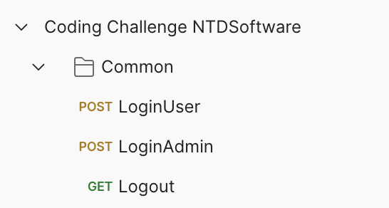
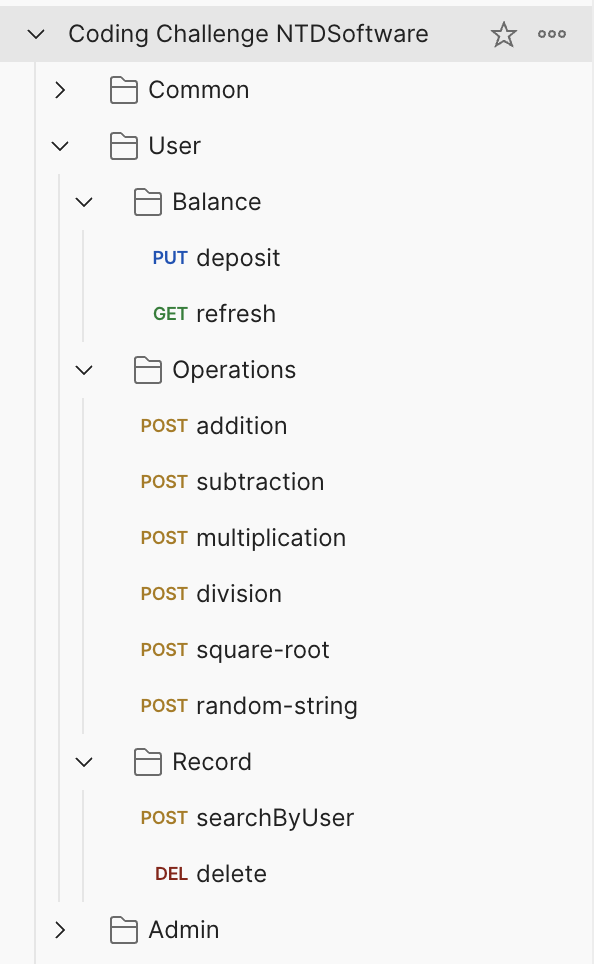
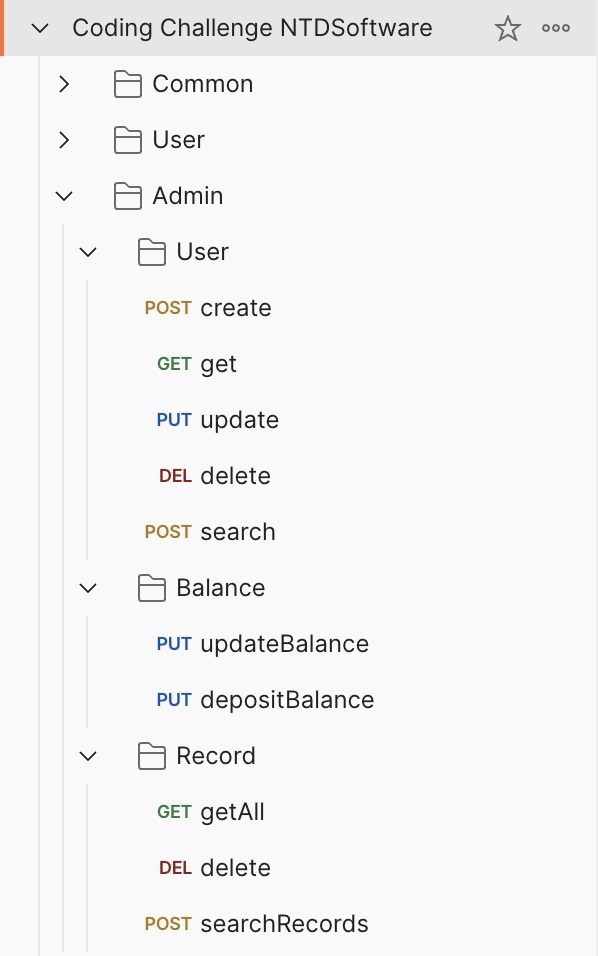

# Arithmetic Calculator REST API

Rest API to provide a simple calculator with next functionality:

- Addition
- Subtraction
- Multiplication
- Division
- Square root
- Random string generation

Each operation has a separate cost per request, and the cost is calculated based on the number
of operations performed by the user. If the user’s balance isn’t enough to cover the request
cost, the request shall be denied.

## Getting Started

These instructions will get you a copy of the project up and running on your local machine.

### Prerequisites

- Java 17
- Maven 4.0.0
- Docker Desktop 4.34.2

### Additional tools

Next tools are optional and can be used to test the API:

- Postman
- MySQL Workbench
- Swagger

### Installing

1. Clone the repository
    ```shell
   git clone git@github.com:casillas51/ntdAssessment.git
    ```
2. Import the project into your favorite IDE
3. Build the project using Maven
    ```shell
   mvn clean install
    ```
4. Run the project
    ```shell
    mvn spring-boot:run
     ```

### Running first time

<p>Project has a MySQL database that is created and populated with some data when the application is started 
for the first time. The database is created using Docker and the script `compose.yaml` that is located in 
folder root of the project.</p> 
<p>Scripts to create the database and tables are located in `src/main/resources/sql` folder.</p>

### Running the tests

<p>Project has to types of tests: unit tests and integration tests. To run the tests use the following command:</p>

- Unit tests
```shell
mvn clean test
```
- Integration tests
```shell
mvn clean verify
```

## Postman configuration

<p>Postman collection is located in `src/test/resources/postman` folder.

1. Import the collection and environment into Postman.
2. Select the environment to load required variables.
3. Open the collection
4. Run the requests in the collection

### Login and Logout

<p>Before running any request, user has to use the `Login` request. There are two login requests 
depending on the user role: `LoginAdmin` and `LoginUser`. The user has to select the request based on the role.</p>
<p>For the first time, the user has to execute login service to generate session token, once the token is generated 
you can execute any request based on user's role. Each request a post-script method to refresh the token for a new 
request</p>
<p>After finishing the tests, the user has to execute the `Logout` request to invalidate the session token.</p>



### User role

<p>User role request are under `User` folder and can perform next operations:</p>

- Balance. Get the user's balance and can increase the balance using the deposit service.
- Operations. Can perform the arithmetic operations, each operation has a cost that is deducted from the
  user's balance.
- Record. Get the user's operations record, the record is paginated and can be filtered by operation type,
  also the user can execute a soft delete operation to remove the record from the list.



### Admin role

<p>Admin role request are under `Admin` folder and can perform next operations:</p>

- Users. CRUD operations for Users, search user is paginated and can be filtered by any field.
- Balance. Can update the user's balance, the balance can be increased or decreased, also has an option to
  deposit a fixed amount to a specific user.
- Record. Get the user's operations record, the record is paginated and can be filtered by operation type, also
  has the option to execute a soft delete operation to remove the record from the list.

